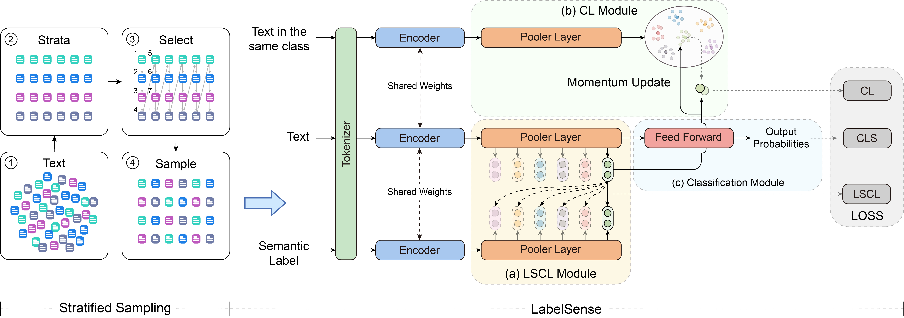

# LabelSense

LabelSense: A Plug-and-play Centroid-based Label Semantic Enhanced Contrastive Learning for Text Classification
<!-- [[paper](https://arxiv.org/)] -->



## TL;DR

LabelSense is a versatile `plug-and-play` method that can be added to any encoder to enhance classification performance by having an awareness of label context.

## Abstract

Understanding the relationship between a concept's intension (features) and extension (examples) is crucial in machine learning classification. Clear and precise definitions of each class (intension) help distinguish classes, while effective generalization (extension) ensures accurate predictions on unseen data. Balancing these aspects enhances model performance and generalization. Addressing the challenge of label semantics in text classification, we present LabelSense, a versatile "plug-and-play" approach that augments labels with rich explanations and illustrative examples, achieving robust label contextualization and enhanced label semantics. Leveraging Centroid-based Learning and contrastive learning techniques, our methodology significantly advances text classification performance across diverse datasets. Evaluation on various datasets, including legal and multi-label text datasets, demonstrates a notable enhancement of over 10 percentage points in Precision@1 compared to the baseline model, highlighting the effectiveness of LabelSense.

## Usage

### ⚙️ Environment

Create a new environment `LabelSense` using conda

```bash
conda create -n LabelSense python=3.11
```

Activate `LabelSense` environment

```bash
conda activate LabelSense
```

Install requirements

```bash
pip install -r requirements.txt
```

### 📖 Dataset

The datasets used in this paper include:

* Multi-class Dataset
  * 20 Newsgroups
  * Blurb Genre Collection (BGC)
  * Web of Science (WOS)
* Multi-label Dataset
  * RCV1-v2
  * Reuters-21578
  * AAPD
  * freecode
  * EUR-Lex

You can download using `data/download.sh`

First you need to change your directory to `data`:

```bash
cd data
```

And download dataset using:

```bash
bash download.sh <Dataset Name>
```

For example, if you want to download `RCV1-v2`:

```bash
bash download.sh RCV1-v2
```

Of course, you can also download all datasets at once:

```bash
bash download.sh all
```

The downloaded dataset is placed in the `origin` folder of the `data/<Dataset Name>` folder

### 🔧 Preprocess

Go to the directory `data/<Dataset Name>` and there is a `preprocess.ipynb`.

By running this jupyter notebook will get the preprocessed files  `id2label.json`, `label2id.json`, `train.json`, `train-with-example.json`, `test.json`, `test-with-example.json`

### 🎯 To Run

Modify the parameters in the `run.sh` file

And run in the project `root` directory:

```bash
bash run.sh
```

The result will be placed in the `output_dir` folder

<!-- ## Citation

If you find LabelSense useful or relevant to your project and research, please kindly cite our paper:

```bibtex
citation
```
 -->
